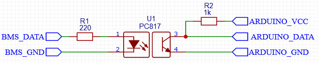

# About

You have built your own battery pack with a [123 Smart BMS](https://123electric.eu/products/123smartbms-gen3/)?
Then this code may help you to connect it to any (I guess) Arduino and read out the BMS data.
This way you can create you own feedback loop for an inverter for example.

## How it Works

On each battery pack you will have at least one `begin` and one `end` module of the BMS (check manual for details).
Also there can be many so called `between` modules.
These modules are connected in series via two wires which are used as communication channel.
In fact these modules use a simple (one way) UART connection to send data from the `begin` to the `end` module.
Each `between` modules can then add/modify data and send the data packet to the next module.
However the packet size is fixed and only one of the between modules per cycle will add cell specific data.
Data related to the whole pack is sent each cycle.
The `end` module has a free connector which can be used to grab these packets.

-  Pin 1: (inverted) data
-  Pin 2: ground
-  Interface: UART
-  Baud rate: 9600
-  Voltage: depends on cell voltage, usually 2.5V to 3.65V for LiFePo4
-  56 bytes of data per packet

## Connect it to Arduino

### Inverted and Isolated by Hardware (Recommended)

-  Connect `BMS_DATA` to pin 1 of the BMS data port
-  Connect `BMS_GROUND` to pin 2 of the BMS
-  Connect `ARDUINO_VCC` to the supply voltage of your Arduino (3.3V or 5V)
-  Connect `ARDUINO_DATA` to any unused pin
-  Connect `ARDUINO_GND` to ground of the Arduino
-  Open [main.cpp](./src/main.cpp)
   -  Set `BMS_SERIAL_RX_PIN` to the used pin
   -  Set `BMS_SERIAL_INVERT` to `false`

### Invert by Software and Connect Directly

-  Make sure the voltage does not exceed the allowed voltage of your controller
-  Connect the data line to any unused Arduio pin
-  Open [main.cpp](./src/main.cpp)
   -  Set `BMS_SERIAL_RX_PIN` to the used pin
   -  Set `BMS_SERIAL_INVERT` to `true`

## So what now?

Well, upload the code and open your serial monitor.
Your Arduino should print out the battery data.
You can do with this data what every you want.
For example turn on/off an inverter depending on the SOC.
